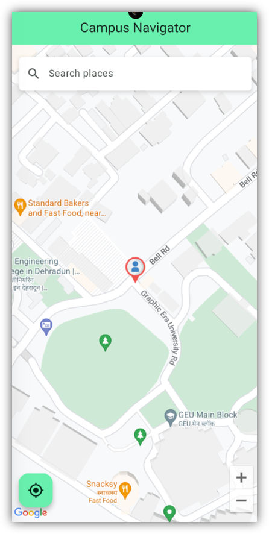
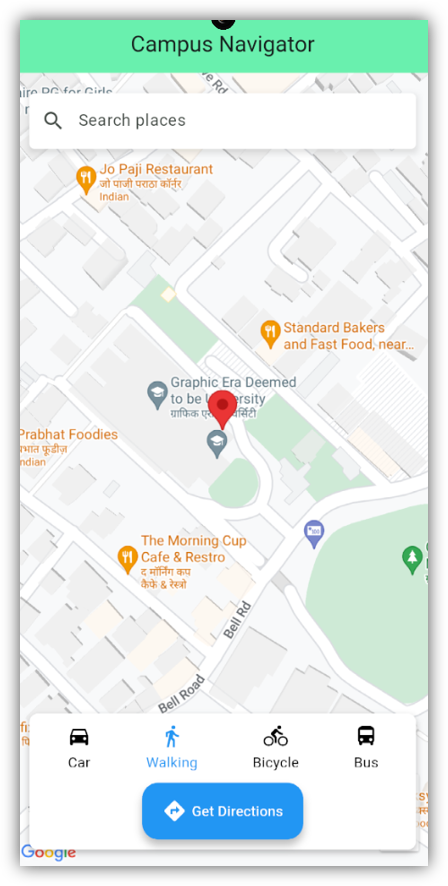
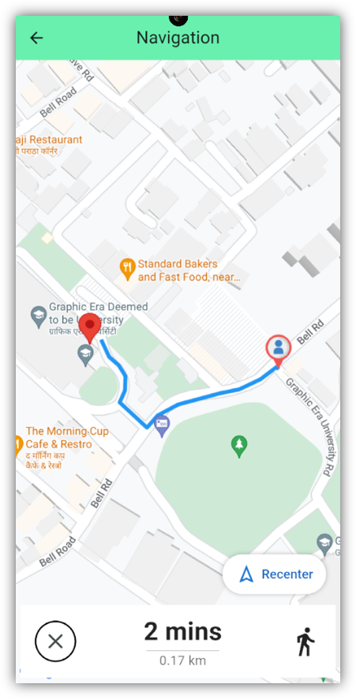
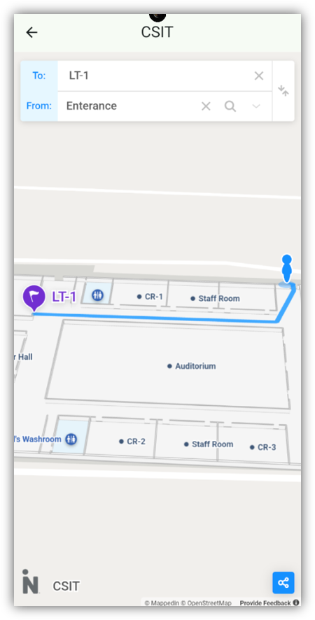

# Campus Navigator

A Flutter-based mobile application designed to help users navigate around campus with interactive maps, real-time location tracking, and route planning.

## Features

- **Interactive Google Maps Integration**: Navigate across campus using Google Maps API
- **Real-time Location Tracking**: Track your current position with custom user markers
- **Multiple Transportation Modes**: Choose between walking, cycling, car, or bus routes
- **Campus Landmark Search**: Search for classrooms, labs, buildings, and other important campus locations
- **Turn-by-turn Navigation**: Get detailed directions with distance and estimated time
- **Route Optimization**: Find the most efficient paths between locations
- **Indoor Navigation Support**: Seamless transition to indoor mapping via WebView for building interiors

## Screenshots

<p align="center">
  
  
  
  
</p>

## Getting Started

### Prerequisites

- Flutter SDK (^3.6.0)
- Dart SDK
- Android Studio / Visual Studio Code
- Google Maps API Key
- OpenRouteService API Key

### API Keys Setup

This app requires two API keys to function properly:

1. **Google Maps API Key**
   - Create a project in the [Google Cloud Console](https://console.cloud.google.com/)
   - Enable the Google Maps API for Android/iOS
   - Generate an API key from the Credentials page
   - Add the key to `android/app/src/main/AndroidManifest.xml`:
     ```xml
     <meta-data
         android:name="com.google.android.geo.API_KEY"
         android:value="YOUR_GOOGLE_MAPS_API_KEY" />
     ```
   - For iOS, follow the instructions at [Google Maps iOS SDK Guide](https://developers.google.com/maps/documentation/ios-sdk/get-api-key)

2. **OpenRouteService API Key**
   - Create a free account at [OpenRouteService](https://openrouteservice.org/)
   - Generate an API key in your dashboard
   - Add the key to `lib/routes.dart`:
     ```dart
     final String apiKey = 'YOUR_OPENROUTESERVICE_API_KEY';
     ```

> **⚠️ Important:** Never commit your actual API keys to a public repository. Use environment variables or a secure method to store sensitive keys.

### Installation

1. Clone this repository:
   ```bash
   git clone https://github.com/aparagarwal/campus-navigator.git
   ```

2. Navigate to the project directory:
   ```bash
   cd campus-navigator
   ```

3. Install dependencies:
   ```bash
   flutter pub get
   ```

4. Set up your Google Maps API key:
   - Add your API key in `android/app/src/main/AndroidManifest.xml`
   - Add your API key in appropriate iOS configuration if needed

5. Run the app:
   ```bash
   flutter run
   ```

## Dependencies

- [google_maps_flutter](https://pub.dev/packages/google_maps_flutter): Google Maps implementation for Flutter
- [geolocator](https://pub.dev/packages/geolocator): Location services with GPS
- [flutter_polyline_points](https://pub.dev/packages/flutter_polyline_points): Drawing routes on the map
- [http](https://pub.dev/packages/http): API requests for routing
- [permission_handler](https://pub.dev/packages/permission_handler): Handle location permissions
- [webview_flutter](https://pub.dev/packages/webview_flutter): Indoor navigation maps
- [image](https://pub.dev/packages/image): Custom marker image processing

## Architecture

The app follows a simple, modular architecture:

- **Main App**: Entry point setting up the theme and home page
- **Map Page**: Main interface with search, map controls, and route options
- **Navigation Page**: Turn-by-turn navigation with real-time updates
- **Custom Locations**: Repository of campus locations and search functionality
- **Route Service**: API integration for route calculation and optimization
- **WebView**: Indoor mapping for building interiors

## API Usage

The app uses OpenRouteService for route calculation:
- `GET /v2/directions/{profile}`: Used for calculating routes between two points
- Documentation can be found [here](https://openrouteservice.org/dev/#/api-docs)
